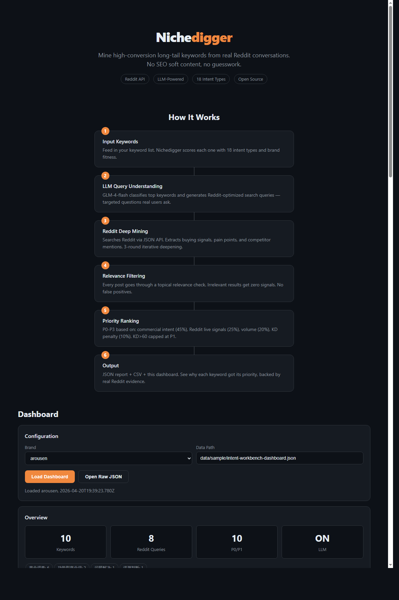

<div align="center">

# 🔍 Nichedigger

**Reddit-Powered Keyword Mining for PSEO**

Mine high-conversion long-tail keywords from real user conversations.

[](https://github.com/1596941391qq/nichedigger)
[](https://opensource.org/licenses/MIT)
[](https://nodejs.org/)

[English](#features) · [中文说明](#中文说明)

</div>

---

## Stop Guessing, Start Mining

Traditional keyword tools give you volume and KD. **Nichedigger tells you WHY people search.**

It mines Reddit for real user conversations, extracts buying signals and pain points, then ranks keywords by what actually converts — not just what gets clicks.

```
Traditional:  "best vibrator" → volume: 12100, KD: 72 → ???
Nichedigger:  "best vibrator" → 47 Reddit threads, 23 buying signals,
              pain: "too loud for roommates" → P0, write best-of guide
```

## Screenshot



## Features

- **18 Intent Types** — From competitor interception (95) to educational (35), every keyword gets a precise commercial intent score
- **Reddit Deep Mining** — Direct JSON API with rate limiting. Buying signals, pain points, competitor mentions extracted from real posts
- **LLM-Powered Research Loop** — GLM-4-flash generates targeted Reddit search queries, iterates 3 rounds, each round deciding the next angle
- **Relevance Filtering** — Token-overlap gate kills false positives. No more nuclear fusion when searching for vibrators
- **KD-Aware Priority** — P0/P1/P2/P3 ranking with keyword difficulty baked in. KD > 60 can never be P0
- **Brand Fitness Scoring** — Each keyword scored against your brand positioning
- **Zero SEO Tool Dependency** — Pure Reddit data. No Semrush subscription needed

## Quick Start

```bash
git clone https://github.com/1596941391qq/nichedigger.git
cd nichedigger
npm install

# Basic usage (no LLM)
export HTTPS_PROXY=http://127.0.0.1:7892
node cli.mjs --keywords "best vibrator,quiet vibrator,vibrator for couples" --brand arousen

# With LLM deep research (recommended)
export LLM_API_KEY=your_glm_key
node cli.mjs --keywords "best vibrator,quiet vibrator" --brand arousen --iterations 3

# Web dashboard mode
node server.mjs  # http://127.0.0.1:4318
```

## How It Works

```
┌─────────────┐     ┌──────────────────┐     ┌─────────────────┐
│  Keywords    │────▶│  Intent Scoring  │────▶│  LLM Classify   │
│  (CSV/text)  │     │  (18 types)      │     │  (Reddit queries)│
└─────────────┘     └──────────────────┘     └────────┬────────┘
                                                       │
              ┌────────────────────────────────────────┘
              ▼
┌──────────────────┐     ┌──────────────────┐     ┌─────────────────┐
│  Reddit Mining   │────▶│  Relevance       │────▶│  Priority       │
│  (3 iterations)  │     │  Filtering       │     │  Ranking (P0-P3)│
│  buying signals  │     │  (token overlap) │     │  KD penalty     │
│  pain points     │     │  <30% = zeroed   │     │  brand fitness  │
│  competitors     │     └──────────────────┘     └────────┬────────┘
└──────────────────┘                                         │
                                                             ▼
                                               ┌──────────────────┐
                                               │  Report + CSV +  │
                                               │  Web Dashboard   │
                                               └──────────────────┘
```

## Priority Formula

```
blended = commercialScore × 0.45      # 18-intent taxonomy
        + liveSignalScore × 0.25      # Reddit buying signals + pain points
        + log10(volume+1)×20 × 0.20   # Search volume
        + KD_penalty × 0.10           # Keyword difficulty (inverse)

Hard caps: KD > 60 → max P1 | KD > 80 → max P2
```

## 18 Intent Taxonomy

| Intent | Weight | Funnel | What It Catches |
|--------|--------|--------|-----------------|
| Competitor Interception | 95 | Bottom | "X vs Y", "alternative to" |
| Transactional Support | 92 | Bottom | "buy", "price", "discount" |
| Review Judgment | 90 | Bottom | "review", "worth it", "legit" |
| Brand Defense | 88 | Bottom | Brand name mentions |
| Commercial Investigation | 82 | Mid | "best X", "top rated" |
| Comparison Shop | 80 | Mid | "compare", "different" |
| Alternative Seeking | 78 | Mid | "similar to", "instead of" |
| Feature-Driven | 75 | Mid | "quiet", "waterproof", "app-controlled" |
| Retention Upsell | 70 | Post | "upgrade", "premium" |
| Objection Handling | 65 | Mid | "safe?", "side effects" |
| UGC Pain Point | 62 | Mid | "disappointed", "broke" |
| Use Case Scenario | 60 | Top | "for travel", "for apartment" |
| Hidden Demand | 58 | Top | "wish there was", "cannot find" |
| Trend Spike | 55 | Top | "viral", "2025", "tiktok" |
| Problem Solution | 55 | Top | "how to", "fix" |
| How-To Usage | 50 | Top | "how to use", "tutorial" |
| Post Purchase | 45 | Post | "how to clean", "not working" |
| Educational | 35 | Top | "what is", "guide" |

## CLI Reference

```
node cli.mjs [options]

  --keywords <string>    Comma-separated keywords or CSV path (required)
  --brand <slug>         Brand slug for fitness scoring (default: generic)
  --output <dir>         Output directory (default: ./output)
  --limit <n>            Max keywords to analyze (default: 30)
  --iterations <n>       LLM research rounds (default: 3)
  --dry-run              Print results, no file output
```

## API Server

```
node server.mjs  (default port: 4318)

GET  /api/health                 Health check
GET  /api/report?brand=arousen   Get latest report
POST /api/run                    Run mining {brand, keywords}
POST /api/site-sync              Sync to static site
```

## Architecture

```
nichedigger/
├── cli.mjs                    Standalone CLI
├── server.mjs                 HTTP API server
├── index.html                 Web dashboard (self-contained)
├── lib/
│   ├── intent-taxonomy.mjs    18 intents + brand fitness + KD ranking
│   ├── source-adapters.mjs    Reddit API + rate limit + relevance filter
│   ├── research-loop.mjs      LLM iterative research (3 rounds)
│   ├── llm-adapter.mjs        GLM-4-flash (OpenAI-compatible)
│   ├── content-extractor.mjs  HTML → text extraction
│   └── report-writer.mjs      JSON + CSV + Markdown output
└── docs/
    └── dashboard.png          Screenshot
```

## Environment Variables

| Variable | Required | Default | Description |
|----------|----------|---------|-------------|
| `HTTPS_PROXY` | China | — | Proxy for Reddit API |
| `LLM_API_KEY` | Optional | — | Enables LLM deep research |
| `LLM_BASE_URL` | No | `https://open.bigmodel.cn/api/paas/v4` | Any OpenAI-compatible endpoint |
| `LLM_MODEL` | No | `glm-4-flash` | Model name |

## Star History

[](https://star-history.com/#1596941391qq/nichedigger&Date)

---

## 中文说明

### 这是什么？

Nichedigger 是 Reddit 驱动的关键词挖掘工具，专为 PSEO（程序化 SEO）设计。

传统工具只告诉你搜索量和难度。Nichedigger 告诉你**为什么**有人搜这个词。

它从 Reddit 真人对话中提取购买信号、痛点和竞品提及，然后按商业意图 + 实时信号 + KD 难度排序，输出优先级关键词列表。

### 工作原理

```
关键词列表 → 18种意图打分 → LLM生成Reddit搜索词 → Reddit三轮迭代挖掘
                                                      ↓
                                              相关性过滤（token重叠<30%归零）
                                                      ↓
                                              P0-P3优先级排序（KD>60不能P0）
                                                      ↓
                                              报告 + CSV + Web看板
```

### 30秒上手

```bash
git clone https://github.com/1596941391qq/nichedigger.git
cd nichedigger && npm install

# 基础用法（不开LLM）
export HTTPS_PROXY=http://127.0.0.1:7892
node cli.mjs --keywords "best vibrator,quiet vibrator" --brand arousen

# 开LLM深度研究（推荐）
export LLM_API_KEY=你的智谱key
node cli.mjs --keywords "best vibrator,quiet vibrator" --brand arousen

# Web看板模式
node server.mjs  # http://127.0.0.1:4318
```

### 核心特性

- **18种意图分类** — 从竞品拦截(95分)到教育科普(35分)，每个词精确打分
- **Reddit深度挖掘** — 直接JSON API，带限速保护。提取购买信号、痛点、竞品提及
- **LLM研究循环** — GLM-4-flash生成定向搜索词，3轮迭代，每轮LLM决定下一个角度
- **相关性过滤** — token重叠<30%的帖子信号归零，杜绝"搜振动棒出核聚变"
- **KD感知排序** — KD>60不能P0，KD>80不能P1
- **品牌适配度** — 每个词按品牌定位打分，"lovense review"对非Lovense品牌=低适配

### 优先级公式

```
总分 = 商业意图 × 0.45 + Reddit实时信号 × 0.25 + 搜索量 × 0.20 + KD惩罚 × 0.10

P0: 总分≥80 且 KD≤60
P1: 总分≥60 且 KD≤80
P2: 总分≥40
P3: <40
```

### 环境变量

| 变量 | 必需 | 说明 |
|------|------|------|
| `HTTPS_PROXY` | 国内必需 | 访问Reddit的代理 |
| `LLM_API_KEY` | 可选 | 开启LLM深度研究（支持智谱/任何OpenAI兼容API） |
| `LLM_MODEL` | 可选 | 默认 `glm-4-flash` |

---

<div align="center">

**如果这个项目对你有帮助，给个 ⭐️ 吧！**

[](https://star-history.com/#1596941391qq/nichedigger&Date)

MIT License

</div>
