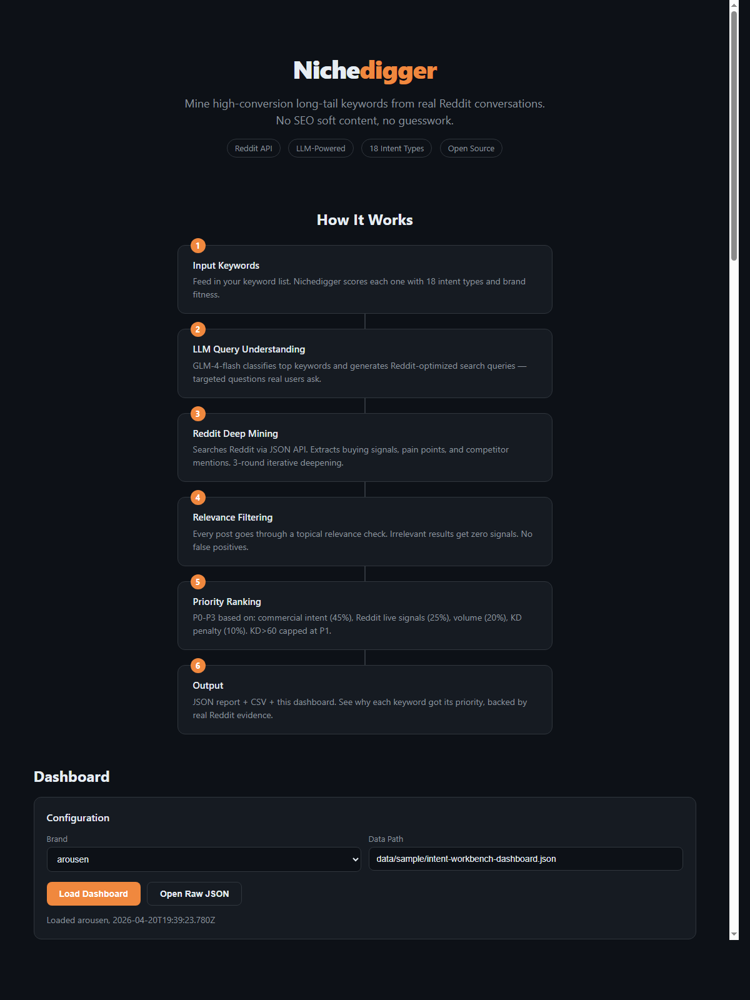
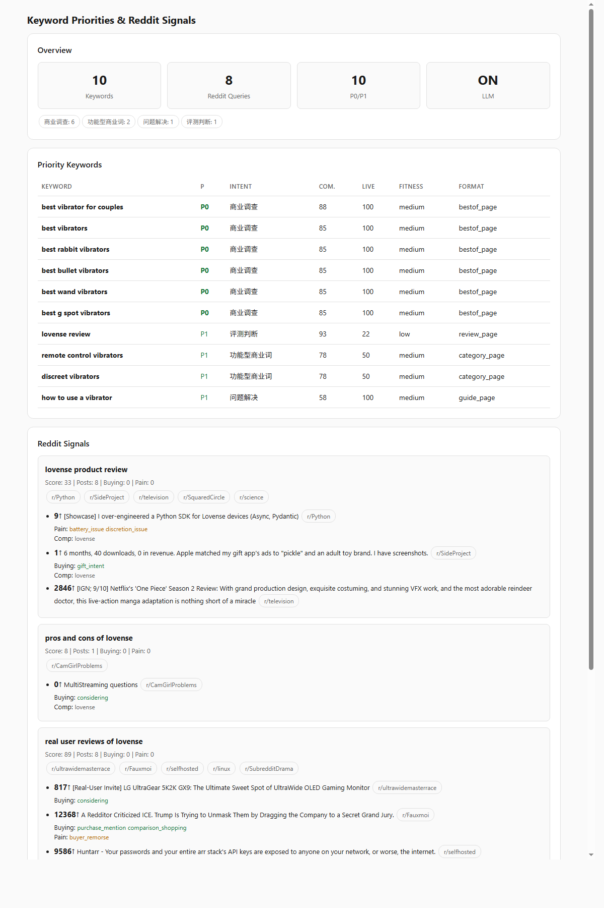

<div align="center">

# 🔍 Nichedigger

**Reddit-Powered Keyword Mining for PSEO**

Mine high-conversion long-tail keywords from real user conversations.

[](https://github.com/1596941391qq/nichedigger)
[](https://opensource.org/licenses/MIT)
[](https://nodejs.org/)

[English](#features) · [中文说明](#中文说明)

</div>

---

## Stop Guessing, Start Mining

Traditional keyword tools give you volume and KD. **Nichedigger tells you WHY people search.**

It mines Reddit for real user conversations, extracts buying signals and pain points, then ranks keywords by what actually converts — not just what gets clicks.

```
Traditional:  "best vibrator" → volume: 12100, KD: 72 → ???
Nichedigger:  "best vibrator" → 47 Reddit threads, 23 buying signals,
              pain: "too loud for roommates" → P0, write best-of guide
```

## What Makes It Different

- **Subreddit Discovery** — Automatically finds which communities discuss your niche, then targets them with `restrict_sr` for 5-10x signal density vs site-wide search
- **Comment Mining** — Reads top 5 comments on every relevant post. The real buying signals live in comments, not titles. Comment signals are merged into the scoring
- **Multi-Sort Search** — Searches by relevance AND by top (upvotes). Different sort modes surface different opportunities
- **Dynamic Competitor Discovery** — Doesn't rely on a hardcoded brand list. Extracts every brand mention from posts and comments, ranked by frequency
- **18 Intent Types** — From competitor interception (95) to educational (35), every keyword gets a precise commercial intent score
- **LLM-Powered Research Loop** — Any OpenAI-compatible LLM generates targeted Reddit search queries, iterates 3 rounds, each round deciding the next angle
- **Relevance Filtering** — Token-overlap gate kills false positives. No more nuclear fusion when searching for vibrators
- **KD-Aware Priority** — P0/P1/P2/P3 ranking with keyword difficulty baked in. KD > 60 can never be P0
- **Zero SEO Tool Dependency** — Pure Reddit data. No Semrush subscription needed

## Screenshots





## How It Works

```
┌─────────────┐     ┌──────────────────┐     ┌─────────────────┐
│  Keywords    │────▶│  Intent Scoring  │────▶│  LLM Classify   │
│  (CSV/text)  │     │  (18 types)      │     │  (Reddit queries)│
└─────────────┘     └──────────────────┘     └────────┬────────┘
                                                       │
              ┌────────────────────────────────────────┘
              ▼
┌──────────────────┐     ┌──────────────────┐     ┌─────────────────┐
│  Subreddit       │     │  Comment Mining  │     │  Multi-Sort     │
│  Discovery       │     │  (top 5 per post)│     │  (relevance+top)│
│  (auto-detect)   │     │  buying signals  │     │  year + month   │
│  targeted search │     │  pain points     │     │  site-wide +    │
│  restrict_sr=on  │     │  from comments   │     │  subreddit      │
└──────┬───────────┘     └──────────────────┘     └────────┬────────┘
       │                                                    │
       └──────────────┬─────────────────────────────────────┘
                      ▼
            ┌──────────────────┐     ┌──────────────────┐
            │  Relevance       │────▶│  Priority        │
            │  Filtering       │     │  Ranking (P0-P3) │
            │  (token overlap) │     │  KD penalty      │
            │  <30% = zeroed   │     │  brand fitness   │
            └──────────────────┘     │  dynamic comps   │
                                     └────────┬─────────┘
                                              │
                                              ▼
                                    ┌──────────────────┐
                                    │  Report + CSV +  │
                                    │  Web Dashboard   │
                                    └──────────────────┘
```

## Quick Start

```bash
git clone https://github.com/1596941391qq/nichedigger.git
cd nichedigger
npm install

# Basic usage (no LLM)
export HTTPS_PROXY=http://127.0.0.1:7892
node cli.mjs --keywords "best vibrator,quiet vibrator,vibrator for couples" --brand arousen

# With subreddit targeting (5-10x signal density)
node cli.mjs --keywords "best vibrator,quiet vibrator" --brand arousen --subreddit SexToys,wandvibers

# With multi-sort search
node cli.mjs --keywords "best vibrator" --brand arousen --sort relevance,top,new

# Without comment mining (faster, less signals)
node cli.mjs --keywords "best vibrator" --brand arousen --no-comments

# With LLM deep research (recommended)
export LLM_API_KEY=your_api_key
node cli.mjs --keywords "best vibrator,quiet vibrator" --brand arousen --iterations 3

# Full power: everything enabled
node cli.mjs --keywords "best vibrator,quiet vibrator" \
  --brand arousen \
  --subreddit SexToys,wandvibers \
  --sort relevance,top \
  --iterations 3

# Web dashboard mode
node server.mjs  # http://127.0.0.1:4318
```

## Mining Pipeline

Nichedigger uses a multi-pass pipeline to maximize signal extraction:

### Pass 1: Site-wide Search
Searches all of Reddit with `sort=relevance` and `sort=top`. This catches high-visibility posts that dominate the niche.

### Pass 2: Subreddit-Targeted Search
Either from `--subreddit` flags or auto-discovered communities. Uses `restrict_sr=on` for surgical precision. A search for "best vibrator" across all of Reddit returns ~40% noise. The same search in r/SexToys returns ~90% relevant results.

### Pass 3: LLM-Driven Iterative Deepening
If LLM is enabled, each round analyzes what was found and decides the next search angle. The LLM can target specific subreddits, try new query formulations, or extract content from promising threads.

### Comment Mining
For every relevant post, the top 5 comments are fetched. Comments contain:
- **Purchase decisions**: "I ended up buying Lovense because..."
- **Use case fit**: "Great for apartment living, can't hear through walls"
- **Comparisons**: "Compared to Lelo, the app is way better"
- **Pain points**: "Battery dies after 20 minutes, not the 2 hours they claim"

These signals are merged with title-level signals for scoring.

### Dynamic Competitor Discovery
Brand mentions are extracted from all post titles + comment bodies. New brands not in the hardcoded list are discovered automatically based on mention frequency (minimum 2 mentions to filter noise).

## Priority Formula

```
blended = commercialScore × 0.45      # 18-intent taxonomy
        + liveSignalScore × 0.25      # Reddit buying signals + pain points (titles + comments)
        + log10(volume+1)×20 × 0.20   # Search volume
        + KD_penalty × 0.10           # Keyword difficulty (inverse)

Hard caps: KD > 60 → max P1 | KD > 80 → max P2
```

## 18 Intent Taxonomy

| Intent | Weight | Funnel | What It Catches |
|--------|--------|--------|-----------------|
| Competitor Interception | 95 | Bottom | "X vs Y", "alternative to" |
| Transactional Support | 92 | Bottom | "buy", "price", "discount" |
| Review Judgment | 90 | Bottom | "review", "worth it", "legit" |
| Brand Defense | 88 | Bottom | Brand name mentions |
| Commercial Investigation | 82 | Mid | "best X", "top rated" |
| Comparison Shop | 80 | Mid | "compare", "different" |
| Alternative Seeking | 78 | Mid | "similar to", "instead of" |
| Feature-Driven | 75 | Mid | "quiet", "waterproof", "app-controlled" |
| Retention Upsell | 70 | Post | "upgrade", "premium" |
| Objection Handling | 65 | Mid | "safe?", "side effects" |
| UGC Pain Point | 62 | Mid | "disappointed", "broke" |
| Use Case Scenario | 60 | Top | "for travel", "for apartment" |
| Hidden Demand | 58 | Top | "wish there was", "cannot find" |
| Trend Spike | 55 | Top | "viral", "2025", "tiktok" |
| Problem Solution | 55 | Top | "how to", "fix" |
| How-To Usage | 50 | Top | "how to use", "tutorial" |
| Post Purchase | 45 | Post | "how to clean", "not working" |
| Educational | 35 | Top | "what is", "guide" |

## CLI Reference

```
node cli.mjs [options]

  --keywords <string>      Comma-separated keywords or CSV path (required)
  --brand <slug>           Brand slug for fitness scoring (default: generic)
  --subreddit <string>     Comma-separated subreddits to target (e.g. SexToys,wandvibers)
  --sort <string>          Comma-separated sort modes: relevance,top,new (default: relevance,top)
  --no-comments            Skip reading top comments (faster but less signals)
  --output <dir>           Output directory (default: ./output)
  --limit <n>              Max keywords to analyze (default: 30)
  --iterations <n>         LLM research rounds (default: 3)
  --dry-run                Print results, no file output
```

## API Server

```
node server.mjs  (default port: 4318)

GET  /              Web dashboard
GET  /api/health    Health check
POST /api/run       Run mining { keywords, brand, subreddit, sort }
```

## Architecture

```
nichedigger/
├── cli.mjs                    Standalone CLI
├── server.mjs                 HTTP API server + dashboard
├── index.html                 Web dashboard (self-contained)
├── lib/
│   ├── intent-taxonomy.mjs    18 intents + brand fitness + KD ranking
│   ├── source-adapters.mjs    Reddit API + subreddit discovery + comment mining
│   ├── research-loop.mjs      LLM iterative research (3 rounds)
│   ├── llm-adapter.mjs        LLM adapter (OpenAI-compatible)
│   ├── content-extractor.mjs  HTML → text extraction
│   └── report-writer.mjs      JSON + CSV + Markdown output
└── docs/
    ├── dashboard-top.png      Screenshot (How It Works)
    └── dashboard-bottom.png   Screenshot (Keywords & Signals)
```

## Environment Variables

| Variable | Required | Default | Description |
|----------|----------|---------|-------------|
| `HTTPS_PROXY` | China | — | Proxy for Reddit API |
| `LLM_API_KEY` | Optional | — | Any OpenAI-compatible API key |
| `LLM_BASE_URL` | No | — | Custom LLM endpoint |
| `LLM_MODEL` | No | `glm-4-flash` | Model name |

## Star History

[](https://star-history.com/#1596941391qq/nichedigger&Date)

---

## 中文说明

### 别猜了，直接挖

传统关键词工具只给搜索量和难度。**Nichedigger 告诉你为什么有人搜这个词。**

它从 Reddit 真人对话中提取购买信号、痛点和竞品提及，然后按商业意图 + 实时信号 + KD 难度排序，输出优先级关键词列表。

```
传统工具: "best vibrator" → 搜索量: 12100, KD: 72 → 接下来呢？
Nichedigger: "best vibrator" → 47条Reddit讨论, 23个购买信号,
             痛点: "室友能听到" → P0优先级, 建议写best-of指南
```

### 和其他工具的区别

- **自动发现 Subreddit** — 自动找到你的品类在哪些社区讨论，然后用 `restrict_sr` 定向搜索，信号密度比全站搜索高 5-10 倍
- **评论深度挖掘** — 读取每个相关帖子的前 5 条评论。真正的购买决策藏在评论里，不在标题里。评论信号直接合并到评分中
- **多维度搜索** — 同时用 relevance 和 top 排序搜索，不同排序维度发现不同机会
- **动态竞品发现** — 不依赖硬编码品牌列表，从帖子标题 + 评论区自动提取品牌提及，按频率排序
- **18种意图分类** — 从竞品拦截(95分)到教育科普(35分)，每个词精确打分
- **LLM研究循环** — 支持任何 OpenAI 兼容 API，3轮迭代，每轮 LLM 决定下一个挖掘角度
- **相关性过滤** — token 重叠 <30% 的帖子信号归零，杜绝"搜振动棒出核聚变"
- **KD感知排序** — KD>60 不能 P0，KD>80 不能 P1
- **零SEO工具依赖** — 纯 Reddit 数据，不需要任何付费订阅

### 截图


### 挖掘管线

Nichedigger 使用多通道管线最大化信号提取：

**第 1 遍：全站搜索**
用 `sort=relevance` 和 `sort=top` 搜索整个 Reddit，捕获高可见度帖子。

**第 2 遍：Subreddit 定向搜索**
来自 `--subreddit` 参数或自动发现的社区。使用 `restrict_sr=on` 精确定位。全站搜 "best vibrator" 约 40% 噪声，在 r/SexToys 搜同样词约 90% 相关。

**第 3 遍：LLM 迭代深挖**
如果启用了 LLM，每轮分析已有发现，决定下一个搜索角度。LLM 可以指定特定 subreddit、尝试新的查询形式、或从有潜力的帖子中提取内容。

**评论挖掘**
对每个相关帖子获取前 5 条评论。评论包含：
- **购买决策**："I ended up buying Lovense because..."
- **场景匹配**："Great for apartment living, can't hear through walls"
- **对比评测**："Compared to Lelo, the app is way better"
- **痛点吐槽**："Battery dies after 20 minutes, not the 2 hours they claim"

这些信号与标题级信号合并用于评分。

**动态竞品发现**
从所有帖子标题 + 评论正文中提取品牌提及。不在硬编码列表中的新品牌会根据提及频率自动发现（最少 2 次提及以过滤噪声）。

### 30秒上手

```bash
git clone https://github.com/1596941391qq/nichedigger.git
cd nichedigger && npm install

# 基础用法（不开LLM）
export HTTPS_PROXY=http://127.0.0.1:7892
node cli.mjs --keywords "best vibrator,quiet vibrator" --brand arousen

# 指定 subreddit（信号密度提升 5-10 倍）
node cli.mjs --keywords "best vibrator,quiet vibrator" \
  --brand arousen --subreddit SexToys,wandvibers

# 多排序维度搜索
node cli.mjs --keywords "best vibrator" --brand arousen --sort relevance,top,new

# 不读评论（更快，信号更少）
node cli.mjs --keywords "best vibrator" --brand arousen --no-comments

# 开LLM深度研究（推荐）
export LLM_API_KEY=你的API_key
node cli.mjs --keywords "best vibrator,quiet vibrator" --brand arousen --iterations 3

# 全火力模式：所有能力全开
node cli.mjs --keywords "best vibrator,quiet vibrator" \
  --brand arousen \
  --subreddit SexToys,wandvibers \
  --sort relevance,top \
  --iterations 3

# Web看板模式
node server.mjs  # http://127.0.0.1:4318
```

### 工作原理

```
┌─────────────┐     ┌──────────────────┐     ┌─────────────────┐
│  关键词列表   │────▶│  18种意图打分     │────▶│  LLM生成搜索词   │
│  (CSV/文本)  │     │  +品牌适配度      │     │  (Reddit优化)    │
└─────────────┘     └──────────────────┘     └────────┬────────┘
                                                       │
              ┌────────────────────────────────────────┘
              ▼
┌──────────────────┐     ┌──────────────────┐     ┌─────────────────┐
│  Subreddit       │     │  评论深度挖掘     │     │  多维度搜索      │
│  自动发现        │     │  (每帖前5条评论)  │     │  (relevance+top)│
│  定向搜索        │     │  购买信号         │     │  年 + 月         │
│  restrict_sr=on  │     │  痛点             │     │  全站 +          │
│  信号密度5-10x   │     │  从评论提取       │     │  subreddit定向   │
└──────┬───────────┘     └──────────────────┘     └────────┬────────┘
       │                                                    │
       └──────────────┬─────────────────────────────────────┘
                      ▼
            ┌──────────────────┐     ┌──────────────────┐
            │  相关性过滤       │────▶│  优先级排序       │
            │  (token重叠检测)  │     │  (P0-P3)         │
            │  <30% = 信号归零  │     │  KD惩罚          │
            └──────────────────┘     │  品牌适配        │
                                     │  动态竞品        │
                                     └────────┬─────────┘
                                              │
                                              ▼
                                    ┌──────────────────┐
                                    │  报告 + CSV +    │
                                    │  Web看板         │
                                    └──────────────────┘
```

### 优先级公式

```
总分 = 商业意图 × 0.45 + Reddit实时信号 × 0.25 + 搜索量 × 0.20 + KD惩罚 × 0.10
     （Reddit实时信号包含标题+评论的购买信号和痛点）

硬限制: KD > 60 → 最高P1 | KD > 80 → 最高P2
```

### 18种意图分类

| 意图类型 | 权重 | 漏斗位置 | 捕获的搜索词 |
|----------|------|----------|-------------|
| 竞品拦截 | 95 | 底部 | "X vs Y"、"alternative to" |
| 交易决策 | 92 | 底部 | "buy"、"price"、"discount" |
| 评测判断 | 90 | 底部 | "review"、"worth it"、"legit" |
| 品牌防御 | 88 | 底部 | 品牌名提及 |
| 商业调查 | 82 | 中部 | "best X"、"top rated" |
| 对比选购 | 80 | 中部 | "compare"、"different" |
| 替代品搜索 | 78 | 中部 | "similar to"、"instead of" |
| 功能型商业 | 75 | 中部 | "quiet"、"waterproof"、"app-controlled" |
| 复购升级 | 70 | 购后 | "upgrade"、"premium" |
| 顾虑消除 | 65 | 中部 | "safe?"、"side effects" |
| UGC痛点 | 62 | 中部 | "disappointed"、"broke" |
| 场景需求 | 60 | 顶部 | "for travel"、"for apartment" |
| 隐性需求 | 58 | 顶部 | "wish there was"、"cannot find" |
| 热点趋势 | 55 | 顶部 | "viral"、"2025"、"tiktok" |
| 问题解决 | 55 | 顶部 | "how to"、"fix" |
| 使用教程 | 50 | 顶部 | "how to use"、"tutorial" |
| 购后支持 | 45 | 购后 | "how to clean"、"not working" |
| 教育科普 | 35 | 顶部 | "what is"、"guide" |

### CLI 参数

```
node cli.mjs [选项]

  --keywords <字符串>       逗号分隔关键词或CSV路径（必填）
  --brand <品牌>            品牌slug，用于适配度打分（默认: generic）
  --subreddit <字符串>      逗号分隔目标subreddit（如 SexToys,wandvibers）
  --sort <字符串>           逗号分隔排序模式: relevance,top,new（默认: relevance,top）
  --no-comments             不读评论（更快但信号更少）
  --output <目录>           输出目录（默认: ./output）
  --limit <数字>            最大关键词数（默认: 30）
  --iterations <数字>       LLM研究轮数（默认: 3）
  --dry-run                 只打印结果，不写文件
```

### API 服务

```
node server.mjs  （默认端口: 4318）

GET  /               Web看板
GET  /api/health     健康检查
POST /api/run        执行挖掘 { keywords, brand, subreddit, sort }
```

### 架构

```
nichedigger/
├── cli.mjs                    独立CLI
├── server.mjs                 HTTP API服务 + 看板
├── index.html                 Web看板（自包含）
├── lib/
│   ├── intent-taxonomy.mjs    18种意图 + 品牌适配 + KD排序
│   ├── source-adapters.mjs    Reddit API + subreddit发现 + 评论挖掘 + 动态竞品
│   ├── research-loop.mjs      LLM迭代研究（3轮）+ 长尾提取
│   ├── llm-adapter.mjs        LLM适配器（OpenAI兼容）
│   ├── content-extractor.mjs  HTML → 文本提取
│   └── report-writer.mjs      JSON + CSV + Markdown输出
└── docs/
    ├── dashboard-top.png      截图（How It Works）
    └── dashboard-bottom.png   截图（关键词 & 信号）
```

### 环境变量

| 变量 | 必需 | 默认值 | 说明 |
|------|------|--------|------|
| `HTTPS_PROXY` | 国内必需 | — | 访问Reddit的代理 |
| `LLM_API_KEY` | 可选 | — | 任何OpenAI兼容API的密钥 |
| `LLM_BASE_URL` | 可选 | — | 自定义LLM端点 |
| `LLM_MODEL` | 可选 | `glm-4-flash` | 模型名 |

---

<div align="center">

**如果这个项目对你有帮助，给个 ⭐️ 吧！**

[](https://star-history.com/#1596941391qq/nichedigger&Date)

MIT License

</div>
